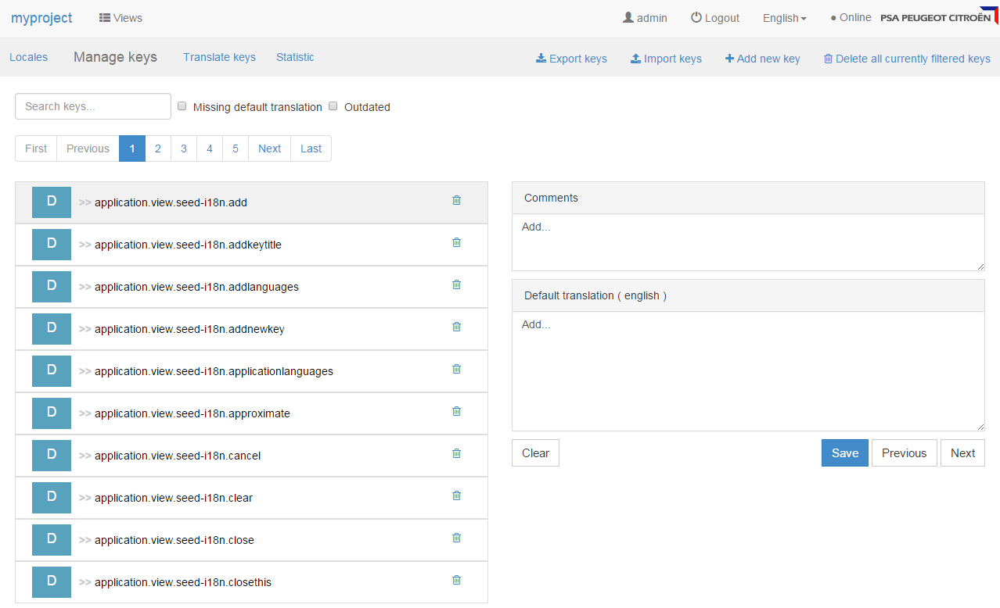

The i18n addon provides backend services and a Web UI to manage your application's locales and translations.



# Integration

To add the i18n addon to your project, start by adding the following dependency. Then configure the persistence
and the security.



## Persistence

The i18n addon uses JPA to store its data. No `persistence.xml` file is provided, as it expects your
application to be configured with [automatically generated persistence information](/addons/jpa/#without-persistence-xml).
You just need add the JPA unit (`seed-i18n-domain`) to the global list of JPA units and specify its datasource:

```ini
[org.seedstack.seed]
persistence.jpa.units = seed-i18n-domain, ...

[org.seedstack.jpa.unit.seed-i18n-domain]
datasource = my-datasource
```

## Security

All the REST APIs are secured with permissions. These permissions are bound to two
default roles:

 * `seed-i18n.reader` for read access
 * `seed-i18n.translator` for read/write/delete access

**Bind the i18n roles to yours**, for instance:

```ini
[org.seedstack.seed.security.users]
john = password, MYPROJECT.DEVELOPER
admin = password, MYPROJECT.TRANSLATOR

[org.seedstack.seed.security.roles]
# Read access
seed-i18n.reader = MYPROJECT.DEVELOPER
# Read/Write/Delete access
seed-i18n.translator = MYPROJECT.TRANSLATOR
```

{}
It is possible to create more fine grained security roles using the provided permissions. Here is the list of available
permissions:

```ini
seed:i18n:locale:read
seed:i18n:locale:write
seed:i18n:locale:delete

seed:i18n:key:read
seed:i18n:key:write
seed:i18n:key:delete

seed:i18n:translation:read
seed:i18n:translation:write
seed:i18n:translation:delete
```
{}

## Cache (Optional)

The addon uses cache to improve i18n performances. By default, this cache does not need configuration,
but it is possible to change the configuration as follow:

```ini
# Default configuration used by the i18n addon
[org.seedstack.seed.i18n.cache]
max-size=8192
concurrency=32
initial-size=2048
```

# Backup/Restore

## CSV

The "Manage Keys" interface provides CSV import/export functionality.

{}
The exported CSV file is in UTF-8 in order to support all the possible languages.
This encoding is not used by default in Microsoft Excel.
{}

## All data

In order to backup/restore all data with their metadata (e.g. default locale or outdated indicator) the addon provides
[shell](/docs/seed/manual/operations/#shell) commands. To use it, enable the Shell support. Then, use the `core:export` or `core:import`
commands (cf. [Core data documentation](/docs/seed/manual/more/#data-import-export)).

# Java API usage

## Locales

The i18n addon stores application available locales and default locale. Available locales are the locales in which
the application is translated, i.e. available to users. The default locale is the "native language" of the application.
This locale will be used as starting locale for translations.

Locales can be managed with i18n administration interface or programatically with the .

```java
@Inject
private LocaleService localeService;
```

## Localization

Localization is provided by the  which allows to localize date, number, string and currency.

```java
@Inject
private LocalizationService localizationService;
```

The  allows to translate i18n keys in different locales using the `localize(String, String)` method.
This method will fallback on the parent locale if the required locale is not present.

```java
// Case 1: fr-BE translation is present
localizationService.localize("fr-BE", "key1"); // -> "translation fr-BE"

// Case 2: fr-BE translation is NOT present, but fr translation is present
localizationService.localize("fr-BE", "key1"); // -> "translation fr"

// Case 2: no translation present
localizationService.localize("fr-BE", "key1"); // -> "[key]"
```


